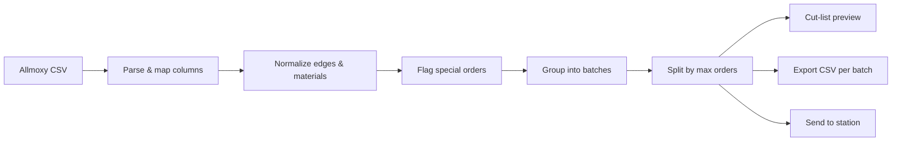

# DBS Drawers — OptiCut CSV Splitter

### What it does and how it works

---

## The problem

Allmoxy exports one large CSV with every drawer part for every order. The Weinig OptiCut saw needs **smaller, material-matched cut lists** — and the shop floor needs **printable cut lists** with box counts per order and group.

This app runs entirely in the browser. No server, no upload of your CSV. You drop in a file and get split batches, printable cut lists, OptiCut-ready exports, and a live **Station** queue.

**Live app:** https://drawerboxspecialties-ops.github.io/OpticutExportAppV2/

**Station:** https://drawerboxspecialties-ops.github.io/OpticutExportAppV2/#station  
(or tap **Station** in the app header)

**One-page guide:** open **Guide** in the app header, or download [PRESENTATION.pdf](public/PRESENTATION.pdf). Regenerate with `npm run presentation:pdf`.

---

## What you get

| Output             | Purpose                                                            |
| ------------------ | ------------------------------------------------------------------ |
| **Split batches**  | Grouped by material category + top edge (+ special orders)         |
| **Cut-list CSV**   | One file per batch, formatted for OptiCut import                   |
| **Cut-list print** | Landscape sheet per batch: widths, F/B and L/R lengths, box counts |
| **Batch index**    | Printable lookup: batch name, boxes, orders + group qty, barcodes  |
| **Station queue**  | Live cut lists on the floor — send from prep, scan barcode to open |
| **ZIP export**     | All batch CSVs in one download                                     |

---

## End-to-end flow



### Step 1 — Import

- Reads comma- or tab-delimited CSV with quoted fields.
- Detects columns by header name (case/spacing insensitive).
- Core columns: `OrderNumber`, `MaterialName`, `PartName`, `W`, `Length`, `Quantity`, `Label`, `Width`, `TopEdge`.
- Optional batching-only columns (read but **not exported**): `GroupID`, `Laser`, `Scoop`, `Slope`, `DrillFront`, `DividersFB`, `DividersSS`, `FileSlots`, `Ship Date`.

### Step 2 — Normalize

- **Top edges** are cleaned to a standard name set.
- **B-edge priority:** if a front (`F`) and back (`B`) row share an order/material/size, the front inherits the back's top edge — so foil and raw wood never split across batches by mistake.
- **Material names** are cleaned for display and shortened for export (≤ 32 chars, thickness at end, PF/HRM rules).

### Step 3 — Special orders (optional, default ON)

An order is **special** when **any row** has a real value (not blank, not `None`) in:

`Scoop`, `Slope`, `DividersFB`, `DividersSS`, `DrillFront`, or `FileSlots`

Special orders get **`SPECIAL_`** batches using the same rules as normal batches: **material + top edge + ship date**. They never share a batch with normal orders of the same material/edge/date.

**Whole sales order rule:** if **any row** on an order has a non-`None` value in Scoop, Slope, DividersFB, DividersSS, DrillFront, or FileSlots, the **entire order** is special. **Laser** and **GroupID** are never used for special detection. The cut-list table shows full imported rows (including Scoop); export still strips batching-only columns.

### Step 4 — Batch grouping

Each row is assigned a batch bucket:

```
[SPECIAL_] + CategoryCode + EdgeCode + Material + TopEdge + ShipDate
```

Rows with the same material and edge but different ship dates land in separate batches. Blank ship dates group together internally but print with no ship-date label. Optional **Combine ship dates** merges dates into one batch when enabled.

| Category               | Code  | Examples                 |
| ---------------------- | ----- | ------------------------ |
| Plywood sides          | `PLY` | Baltic birch ply         |
| FAA sides              | `FAA` | FAA-prefixed materials   |
| Solid sides            | `SLD` | Alder, maple, oak, etc.  |
| MDF / PBC / PVC & tape | `MDF` | MDF, melamine, PVC edges |

**Batch name (file / barcode):** `[SPECIAL_]CAT_EDGE_firstOrder`  
Example: `PLY_PVC_602480`, `SPECIAL_PLY_CFB_602627`

Within each bucket, orders can be **split** into multiple batches (max orders per batch, or per-group override). Each order number appears in **exactly one** split batch.

### Step 5 — Box math

Box counts use the fixed shop rule `ceil(parts ÷ 4)`:

```
per GroupID       = ceil(parts in that group ÷ 4)
order total       = sum of per-GroupID boxes (when GroupID column exists)
                  = ceil(total parts for order ÷ 4) when no GroupID
batch total       = sum of order totals
```

**Print Cut List layout:**

- Landscape letter, three-column fluid flow: fill column 1 top-to-bottom, wrap to columns 2–3 on the same page; next order continues under the previous table.
- Batch header: total boxes, order numbers, material, top edge, ship date, **Code 128 barcode**.
- Each order block: order number + box summary (e.g. `3 boxes (1-2, 2-1)`).
- Table columns: **Grp** (when GroupID exists), **W**, **F / B**, **L / R**, **Bx**, **Pcs**, checkbox.
- Identical lines (same group, width, and lengths) merge; sorted by order → width ↓ → length ↓.
- ★ marks special groups/orders.
- **\*DFM** marks lines where the front material differs from B/L/R (front-only DFM).

Widths shown to operators are **rounded up to whole numbers** for readability. Export can optionally do the same.

**Batch index print:** one landscape sheet of all batches — barcode, name, boxes, order count, and each order with group qty in brackets (e.g. `602480 (1-2, 2-1)`). Use it to label PCs and scan at the station.

### Step 6 — Export

Exported CSV contains only the **9 standard OptiCut columns**. Batching-only columns are stripped.

When **round export widths** is ON (default):

- `Width` rounds up to whole numbers
- Identical rows merge; quantities sum
- `Label` records original widths when rounding changed them (e.g. `Rounded from Width: 3.937 x8, 4 x4`)
- `W` and `Label` are blanked on normal export rows

Material names are reformatted to OptiCut's 32-character limit.

### Step 7 — Station (shop floor)

1. On the prep computer, click **Export ZIP** (downloads all CSVs and sends every batch to the station queue). Use **Send to station** only to re-send one batch without exporting.
2. On the floor computer, open **Station** (header link or `#station`).
3. Scan a batch barcode (from Batch index or cut-list header) or tap a batch in the queue.
4. Check off cut-list lines; progress syncs live.
5. **Remove** soft-hides a batch (amber row + **Add back**). **Wipe database** permanently deletes every batch — password **`dbs`**.

Station jobs auto-expire after **14 days**.

---

## Architecture

```
index.html          UI shell
src/main.js         Controller — state, DOM events, download/print/station send
src/ui/             Cut-list print + station view
src/logic/          Pure business rules — no DOM, fully unit-tested
tests/              Vitest tests lock every critical rule
```

---

## Key files

| File                         | Role                                           |
| ---------------------------- | ---------------------------------------------- |
| `src/logic/headers.js`       | Column detection + export column filtering     |
| `src/logic/grouping.js`      | Batch creation, merging, splitting, exclusions |
| `src/logic/specialOrders.js` | Special-order detection                        |
| `src/logic/shipDate.js`      | Ship-date batch grouping + print labels        |
| `src/logic/groupBoxes.js`    | Per-GroupID box totals + order-total reconcile |
| `src/logic/boxMath.js`       | `ceil(parts/4)` box matrix                     |
| `src/logic/exportRows.js`    | Cut-list row prep, width rounding merge        |
| `src/logic/materialNames.js` | OptiCut material name formatting               |
| `src/logic/cutListPrint.js`  | Flat cut-list print rows (pair, merge, sort)   |
| `src/logic/code128.js`       | Code 128 barcodes for batch keys               |
| `src/logic/stationSync.js`   | Firestore station queue (send, soft-delete, wipe) |
| `src/ui/cutListPrintView.js` | Cut-list + batch-index print HTML              |
| `src/ui/stationView.js`      | Live station UI                                |

---

## Operator checklist

1. Export CSV from Allmoxy (with optional extra columns if used).
2. Open the live app → drag & drop the file.
3. Review batches in the sidebar (look for **SPECIAL** badge if applicable).
4. Print **Cut list** / **Cut lists**, and **Batch index** for barcodes.
5. **Export ZIP** to download OptiCut CSVs and push all batches to the floor computer.
6. Export current CSV or ZIP all batches → import into OptiCut.
7. On station: scan barcode or pick batch; check lines; Remove / Add back as needed.

---

## Tech stack

- **Vite** — build & dev server
- **Vanilla JS** — no framework; runs offline after load (station needs network for sync)
- **Firebase Firestore** — live station queue
- **Vitest** — automated tests
- **ESLint + Prettier** — code quality
- **GitHub Pages** — hosting from `/docs` on `main`
- **JSZip** — lazy-loaded for ZIP export

---

_DBS Drawers internal tooling — Drawer Box Specialties_
