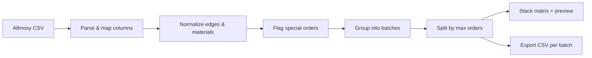

# DBS Drawers — OptiCut CSV Splitter
### What it does and how it works

---

## The problem

Allmoxy exports one large CSV with every drawer part for every order. The Weinig OptiCut saw needs **smaller, material-matched cut lists** — and the shop floor needs **stack sheets** that tell operators how many boxes to pull per height and order.

This app runs entirely in the browser. No server, no upload. You drop in a CSV and get split batches, printable stack matrices, and OptiCut-ready export files.

**Live app:** https://drawerboxspecialties-ops.github.io/OpticutExportAppV2/

---

## What you get

| Output | Purpose |
|--------|---------|
| **Split batches** | Grouped by material category + top edge (+ special orders) |
| **Cut-list CSV** | One file per batch, formatted for OptiCut import |
| **Stack matrix** | On-screen and printable sheet: heights × orders, box counts |
| **ZIP export** | All batch CSVs in one download |

---

## End-to-end flow



### Step 1 — Import

- Reads comma- or tab-delimited CSV with quoted fields.
- Detects columns by header name (case/spacing insensitive).
- Core columns: `OrderNumber`, `MaterialName`, `PartName`, `W`, `Length`, `Quantity`, `Label`, `Width`, `TopEdge`.
- Optional batching-only columns (read but **not exported**): `GroupID`, `Laser`, `Scoop`, `Slope`, `DrillFront`, `DividersFB`, `DividersSS`, `FileSlots`.

### Step 2 — Normalize

- **Top edges** are cleaned to a standard name set.
- **B-edge priority:** if a front (`F`) and back (`B`) row share an order/material/size, the front inherits the back's top edge — so foil and raw wood never split across batches by mistake.
- **Material names** are cleaned for display and shortened for export (≤ 32 chars, thickness at end, PF/HRM rules).

### Step 3 — Special orders (optional, default ON)

An order is **special** when **any row** has a real value (not blank, not `None`) in:

`Scoop`, `Slope`, `DividersFB`, `DividersSS`, `DrillFront`, or `FileSlots`

`Laser` and `GroupID` are ignored for this check.

Special orders still split by material + top edge, but get their own **`SPECIAL_`** batches so they never share a batch with normal orders of the same material/edge.

### Step 4 — Batch grouping

Each row is assigned a batch bucket:

```
[SPECIAL_] + CategoryCode + EdgeCode + Material + TopEdge
```

| Category | Code | Examples |
|----------|------|----------|
| Plywood sides | `PLY` | Baltic birch ply |
| FAA sides | `FAA` | FAA-prefixed materials |
| Solid sides | `SLD` | Alder, maple, oak, etc. |
| MDF / PBC / PVC & tape | `MDF` | MDF, melamine, PVC edges |

Within each bucket, orders can be **split** into multiple batches (max orders per batch, or per-group override). Each order number appears in **exactly one** split batch.

### Step 5 — Box math (stack matrix)

The stack matrix summarizes parts by **drawer height** (`Width` column) and **order number**.

```
boxes per cell  = ceil(parts ÷ 4)
order column    = ceil(total parts for that order ÷ 4)
batch total     = sum of order column boxes
```

This `÷ 4` rule is fixed shop logic — it drives every box count on screen and on print.

Widths shown to operators are **rounded up to whole numbers** for readability. Export can optionally do the same.

### Step 6 — Export

Exported CSV contains only the **9 standard OptiCut columns**. Batching-only columns are stripped.

When **round export widths** is ON (default):

- `Width` rounds up to whole numbers
- Identical rows merge; quantities sum
- `Label` records original widths when rounding changed them (e.g. `Rounded from Width: 3.937 x8, 4 x4`)
- `W` and `Label` are blanked on normal export rows

Material names are reformatted to OptiCut's 32-character limit.

---

## Architecture (how it was built)

The original app was a single `index.html` file with all logic inline. Version 2 **reverse-engineered** that behavior into tested modules:

```
index.html          UI shell
src/main.js         Controller — state, DOM events, download/print
src/ui/             HTML render helpers (stack matrix, print cards)
src/logic/          Pure business rules — no DOM, fully unit-tested
tests/              146 Vitest tests lock every critical rule
```

**Development process:**

1. **Capture behavior** — read the original monolith and document every business rule (box math, B-edge priority, width vs W, material formatting).
2. **Extract pure functions** — one module per concern (`csv`, `headers`, `grouping`, `boxMath`, etc.).
3. **Test first** — write Vitest tests against the original rules before refactoring UI.
4. **Modernize UI** — Vite build, CSS design system, responsive layout, print-specific styles.
5. **Deploy** — GitHub Actions builds `dist/`, copies to `docs/`, pushes to GitHub Pages.
6. **Iterate from shop feedback** — print layout fixes, order exclusion dropdown, special-order batches, export column filtering.

---

## Key files

| File | Role |
|------|------|
| `src/logic/headers.js` | Column detection + export column filtering |
| `src/logic/grouping.js` | Batch creation, merging, splitting, exclusions |
| `src/logic/specialOrders.js` | Special-order detection |
| `src/logic/boxMath.js` | `ceil(parts/4)` box matrix |
| `src/logic/exportRows.js` | Cut-list row prep, width rounding merge |
| `src/logic/materialNames.js` | OptiCut material name formatting |
| `src/ui/stackMatrixView.js` | Stack matrix + print card HTML |

---

## Operator checklist

1. Export CSV from Allmoxy (with optional extra columns if used).
2. Open the live app → drag & drop the file.
3. Review batches in the sidebar (look for **SPECIAL** badge if applicable).
4. Print stack matrix for the current batch or print all batches.
5. Export current CSV or ZIP all batches.
6. Import each CSV into OptiCut.

---

## Tech stack

- **Vite** — build & dev server
- **Vanilla JS** — no framework; runs offline after load
- **Vitest** — 146 automated tests
- **ESLint + Prettier** — code quality
- **GitHub Pages** — hosting from `/docs` on `main`
- **JSZip** — lazy-loaded for ZIP export

---

*DBS Drawers internal tooling — Drawer Box Specialties*
